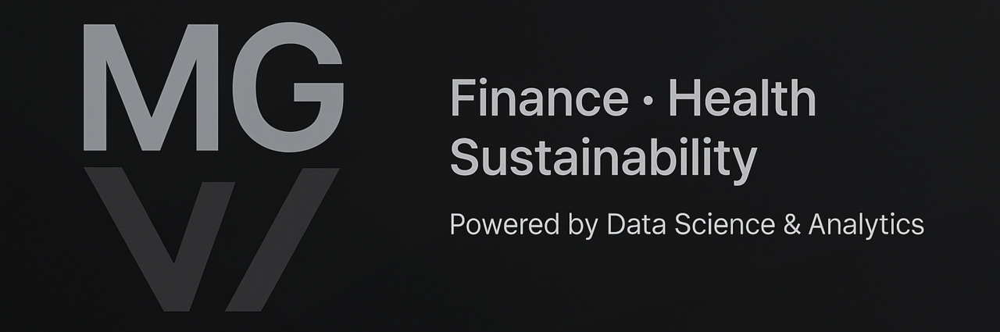

  <picture>
    <source media="(min-resolution: 2dppx)" srcset="./assets/banner-2560.png">
    
  </picture>

# Hi, I’m Maxim (builtbymaxim)

🎓 Business Informatics student @ WU Vienna  
📊 Focus: Data Science, Finance & Business Analytics  
🚀 Building projects at the intersection of **Finance, Health, and Sustainability**

---

### 🔧 Tech Stack

---

### 📌 Featured Projects
🔓 **Public**
- [HealthPulse Analytics](https://github.com/builtbymaxim/healthpulse-analytics)  
  AI-powered health intelligence & glucose prediction dashboard.  
   
   
  

🔒 **Private (available upon request)**  
- **FinSight** – AI-powered financial data pipeline & trading signals dashboard  
- **GW-Pilot** – NLP pipeline for greenwashing risk detection in annual reports  
- **Valuation Engine** – Automated valuation (DCF & comparables)  
- **WU Registration Tool** – Process automation for academic administration  

---

### 📈 Current Focus
- Developing reproducible NLP pipelines to quantify **greenwashing risk** in annual reports  
- Building financial & health dashboards with **real-time analytics**  
- Applying **machine learning and visualization** to decision-making in business contexts  

---

### 📫 Let’s Connect
  

---
